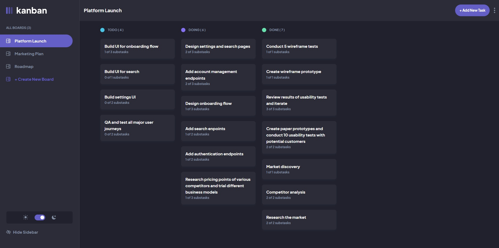

Here's a professional README for your EA Task Tracker project:

```markdown
# EA Task Tracker - Enterprise Architecture Management System

A comprehensive task management system built for Co-operative Bank of Kenya's Enterprise Architecture team, featuring a modern Vue.js frontend and powerful Django REST Framework backend.

## 🎯 Overview

EA Task Tracker is a full-stack solution designed to manage and track Enterprise Architecture projects across multiple architects. It provides visual workflow management, advanced search capabilities, historical tracking, and comprehensive reporting.

### ✨ Key Features

**Frontend (Vue 3 + Tailwind CSS):**
- 📋 Visual Kanban boards for each architect
- 🎨 Co-operative Bank green theme with responsive design
- 🔄 Drag & drop task management (To Do → In Progress → Done)
- 📱 Mobile-friendly interface
- 🌓 Clean, professional UI optimized for executive demos


**Backend (Django REST Framework):**
- 🔐 JWT authentication with role-based access
- 🔍 Advanced search & filtering across all task fields
- 📊 Report generation (CSV/Excel exports)
- 📝 Complete audit trail & historical tracking
- 📎 File attachments for tasks
- 🔔 Notification system
- 👨‍💼 Custom admin portal with visual dashboards
- 🗄️ Support for both SQLite (dev) and MySQL (production)

### 🎨 Screenshots



### 🔗 Links

- **Live Demo**: [Coming Soon]
- **API Documentation**: `http://localhost:8000/swagger/`
- **Admin Portal**: `http://localhost:8000/admin/`

---

## 🚀 Quick Start

### Prerequisites

- Python 3.8+
- Node.js 14+
- MySQL 8.0+ (or SQLite for development)

### Frontend Setup

```bash
# Navigate to frontend
cd EA-Task-Tracker

# Install dependencies
npm install

# Run development server
npm run dev

# Build for production
npm run build
```

### Backend Setup

```bash
# Navigate to backend
cd task-tracker

# Activate virtual environment
source venv/bin/activate  # macOS/Linux
# venv\Scripts\activate   # Windows

# Install dependencies
pip install -r requirements.txt

# Create .env file
cp .env.example .env

# Run migrations
python manage.py migrate

# Create superuser
python manage.py createsuperuser

# Start server
python manage.py runserver
```

---

## 🏗️ Tech Stack

### Frontend
- **Vue 3** - Progressive JavaScript framework
- **Tailwind CSS** - Utility-first CSS framework
- **Vite** - Next-generation frontend tooling
- **Axios** - HTTP client for API calls
- **Vue Router** - Client-side routing

### Backend
- **Django 4.2** - High-level Python web framework
- **Django REST Framework** - Powerful toolkit for building Web APIs
- **JWT Authentication** - Secure token-based auth
- **MySQL/SQLite** - Database options
- **Swagger/OpenAPI** - API documentation
- **Celery** - Async task processing (optional)

### Key Features Implemented
- 📦 **10 Database Models** with relationships
- 🔌 **40+ API Endpoints** with filtering
- 🔍 **Full-text Search** across tasks
- 📈 **Report Generation** in multiple formats
- 📜 **Historical Tracking** with audit logs
- 🎨 **Custom Admin Interface** with badges & actions
- 🔐 **Role-based Access Control**

---

## 📊 Project Structure

```
task-tracker/
├── EA-Task-Tracker/              # Vue Frontend
│   ├── src/
│   │   ├── components/           # Vue components
│   │   ├── views/                # Page views
│   │   ├── stores/               # State management
│   │   └── assets/               # Static assets
│   └── tailwind.config.js        # Co-op Bank theme
│
├── tasktracker_backend/          # Django Project
│   ├── settings.py               # Configuration
│   └── urls.py                   # URL routing
│
├── tasks/                        # Django App
│   ├── models.py                 # 10 database models
│   ├── serializers.py            # DRF serializers
│   ├── views.py                  # API viewsets
│   ├── admin.py                  # Custom admin
│   └── migrations/               # Database migrations
│
├── manage.py                     # Django CLI
├── requirements.txt              # Python dependencies
└── README.md
```

---

## 🔌 API Endpoints

### Authentication
- `POST /api/auth/login/` - Obtain JWT token
- `POST /api/auth/refresh/` - Refresh token

### Core Resources
- `GET/POST /api/boards/` - Board management
- `GET/POST /api/tasks/` - Task CRUD operations
- `POST /api/tasks/search/` - Advanced search
- `POST /api/tasks/{id}/move/` - Move task between columns
- `GET /api/tasks/my_tasks/` - Current user's tasks
- `GET /api/tasks/due_soon/` - Tasks due in 7 days

### Reports & Analytics
- `POST /api/reports/generate_task_summary/` - Generate CSV/Excel
- `POST /api/reports/generate_team_performance/` - Team metrics
- `GET /api/boards/{id}/statistics/` - Board statistics

### Full API Documentation
Visit `/swagger/` when running the backend

---

## 👥 Team & Roles

**Current Users:**
- **Ann Madigo** - Solution Architect (17 tasks)
- **Faith N. Oling'a** - Enterprise Architect (25 tasks)
- **Simon Thuku** - Architect (5 tasks)
- **Duncan Situma** - Architect (21 tasks)

**Total**: 68 active EA projects tracked

---

## 🎨 Customization

### Frontend Theme
Co-operative Bank green theme configured in `tailwind.config.js`:
- Primary: `#00A86B` (Co-op Bank green)
- Success: `#00C853` (Bright green)
- Workflow colors for visual distinction

### Backend Admin
Custom admin interface with:
- Color-coded status badges
- Priority indicators
- Progress bars
- Bulk actions
- Advanced filters

---

## 📝 Environment Variables

### Frontend (.env)
```env
VITE_API_URL=http://localhost:8000/api
```

### Backend (.env)
```env
DEBUG=True
SECRET_KEY=your-secret-key-here
DATABASE_NAME=ea_task_tracker
DATABASE_USER=ea_user
DATABASE_PASSWORD=your-password
DATABASE_HOST=localhost
DATABASE_PORT=3306
CORS_ALLOWED_ORIGINS=http://localhost:5173
```

---

## 🧪 Testing

```bash
# Backend tests
python manage.py test

# Frontend tests
npm run test
```

---

## 📦 Deployment

### Frontend (Netlify/Vercel)
```bash
npm run build
# Deploy 'dist' folder
```

### Backend (Production)
```bash
# Use gunicorn
gunicorn tasktracker_backend.wsgi:application --bind 0.0.0.0:8000

# Or use Docker
docker-compose up -d
```

---

## 🤝 Contributing

This is an internal Co-operative Bank of Kenya project. For contributions or issues, contact the Enterprise Architecture team.

---

## 📄 License

Internal use - Co-operative Bank of Kenya  
Enterprise Architecture Department

---

## 👨‍💻 Author

**Ann Steffie Madigo**  
Solution Architect | Enterprise Architecture  
Co-operative Bank of Kenya  
📧 amadigo@co-opbank.co.ke


```
